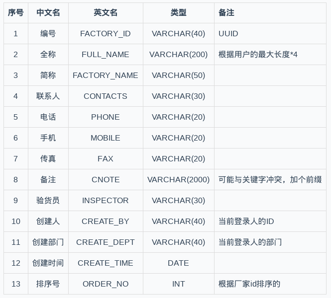

### 需求说明书
1. 描述业务个功能
### 概要设计
1. 细化描述业务功能
2. 以表格形式描述数据库表（表+字段+具体描述）

生产厂家信息维护基础表----FACTORY_C
目的： 为在购销合同模块中的货物信息和附件信息都有所属的生产厂家
注：还不是最终的，还是需要根据现实需求详细设计



### maven工程增加依赖(保存这些文件)
1. 主要核心框架 SpringMVC,Spring,Mybatis
2. c3p0, mysql驱动
3. 第三方核心jar
4. 日常的工具，jar log4j，junit, POI
5. 排除冲突的jar servlet.jar , TOMCAT实现
6. 更改maven仓库位置
7. 创建常用配置文件
```xml
FactoryMapper.xml文件
<mapper namespace="com.hwolf.mapper.FactoryMapper">
  <resultMap type="com.hwolf.model.Factory" id="factoryRM">
    <!--主健-->
    <id property="id" column="factory_id"/>
    <!--一般属性-->
    <result property="fullName" column="full_name"/>
    ...
    ...
  </resultMap>
  <!--查询-->
  <!--在parameterType中只有map，
  resultMap就是上面配置好的resultMap属性，取id-->
  <select id="find" parameterType="map" resultMap="factoryRM">
      <!--查询语句，预留-->
	  select * from factroy_c
	  where id=1
  </select>

```

1. BaseDao.java文件的创建，日常的增删改查，泛型BaseDao< T\>，里面有find，get等方法，也是泛型。
2. BaseDaoImp.java(Mybatis 1.2之后必须注入SqlSessionDaoSupport),实现BaseDao的方法，需要以命名空间（namespace）为参数
- 其中：namespace创建get，set方法
- sqlSessionFactory 创建set方法
- 根据mybatis语法特性，利用getSqlSession.getxxxx等方法实现增删改查。
3. FactoryDao直接继承BaseDao接口
4. FactoryDaoImp继承BaseDaoImp< Factroy\> （注意泛型），再继承FactoryDao
- 因为FactoryDaoImp是具体实现类，所以加入注解@Respositry
5. 创建Service----FactoryService接口
- 基础的增删改查
- 复杂的方法
6. FactoryServiceImp实现类
注解注入FactoryDao,返回factoryDao中的参数
- @Resource --JDK的注解
- @Autowired -- Spring注解
7. Controller分目录
- controller/basicinfo
- basicinfo/factory
- factory/FactoryController.java
8. FactoryController.java 继承BaseController,
同样，
**接下来详细解释：创建获取数据库数据，返回列表页面的过程**
```java
//1.注解注入Service
@Autowired 
FactoryService factoryService;
//2.方法所对应的请求路径
@RequestMapping(/basicinfo/factory/list.action)
//3.返回jsp页面的方法
public String list(Model model){
    //4.从数据库中获取数据，其中是通过注入的factoryService
    List<Factory> dataList = factoryService.find(null);
    //5.将获取的数据值传递给前端页面
    model.addAttribute("dataList",dateList);
    //6.返回一个jsp页面,路径
    return "/basicinfo/factory/jFactoryList.jsp";
}
```
9. 创建jsp：WEB-INF/pages/basicinfo/factory/jFactoryList.jsp
10. 配置Spring -- bean.xml
- 1.头文件xsd
- 2.加载数据库配置jdbc.properties文件放在resource目录下
- 3.包扫描dao,service
- 4.dataSource --- c3p0
c3p0.CombPooledDataSource
技巧：
1.有时候我们会发现property name 配置driver可以是jdbcDriver或者是driverClass，这时需要根据我们导入的dataSource查看源码来配置。
2.利用jdbc.properties文件
```xml
<!--数据库配置-->
<property name="driverClass" value=${}/>
<property name="jdbcUrl" value=${}/>
...
...

<!--链接池配置-->
<property name="maxPoolSize" value=${}/>
...
...

```
- 5.SessionFactory Bean
mybatis下是sqlSessionFactory
```xml
<bean id="sqlSessionFactory" class="...spring.SqlSessionFactoryBean">
<property id="dataSource" ref="dataSource"/>
spring整合mybatis

</bean>
```
- 5.事务transaction
```xml
<bean id="txManage" class="..DataSourceTransactionManager">
绑定dataSource
<property name="dataSource" ref="dataSource"/>
```
- 6.配置tx:advice  事务处理通知
```xml
<tx:advice id="txAdvice" transaction-manager="txManager">
  <tx:attributes>
  哪些方法事务处理后需要通知：
   <tx:method name="insert*" propagation="REQUIRED"/>
   <tx:method name="delete*" propagation="REQUIRED"/>
   <tx:method name="update*" propagation="REQUIRED"/>

  ....
  ....
  <tx:method name="find*" read-only="true"/>
  </tx:attributes>
</tx:advice>
```
7.配置aop，管理所有的service包下的类
```xml
<aop:config>
  切入点
  <aop:pointcut expression="execution (com.hwolf.service.*.*(..))" id="txPointCut" />
  将通知注入aop，这样才能生效
  <aop:advisor advice-ref="txAdvice" pointcut-ref="txPointCut"/>
</aop:config>
```
11. springmvc-servlet
1.包扫描controller
2.内部资源视图解析---jsp,css,html文件
- 一个bean
- 在InternalResourceViewResolver类下
配置前缀：
配置后缀：//可以不配置。便于在url下加参数	

12. 配置web.xml
- 1.spring框架
```xml
<context-param>
  <param-name>contextConfigLocation</param-name>
  <param-value>classpath:beans.xml</param-value>
</context-param>
监听器
<listener>
  <listener-class>
  org.springframework.web.context.ContextLoaderListener
  </listener-class>
</listener>
```

- 2.springmvc servlet---也要加载spring-mvc.xml
```
拦截器
DispatcherServlet
```
- 3.filter，过滤器，乱码解析